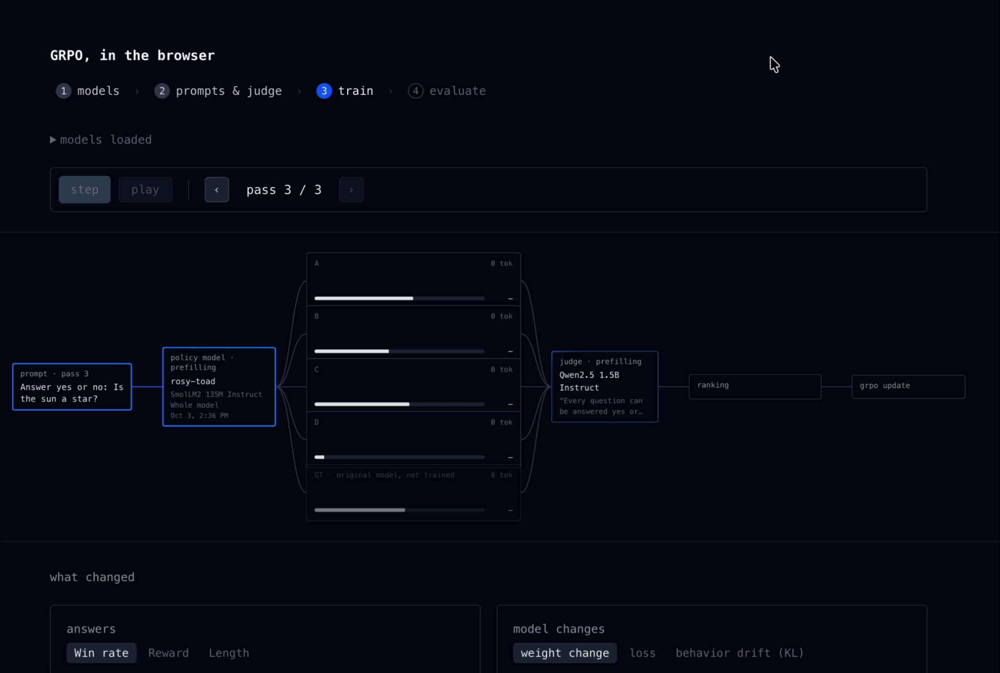

# Promo

## Tweets

> got curious about RL fine-tuning so I built a tiny version in the browser. model answers each prompt 4x, a bigger judge picks the best answer (Jev/logit classifier style), and GRPO updates the weights

> you can A/B test inference on the fine-tuned model too. runs all locally with webgpu, built in @ekzhang's jax-js - try it at grpo dot lucasgelfond dot online

## Show HN

Show HN: GRPO playground - RL fine-tune a small language model wholly in the browser
